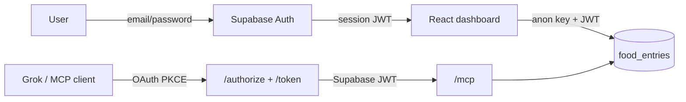

# Nutrition Tracker

A single-page daily-nutrition dashboard with per-user accounts, backed by Supabase Auth + RLS, and a companion MCP server for AI agents.

## Stack

- **React 19** + **Vite 8** + **Tailwind 4** — web dashboard (`packages/web`)
- **TypeScript 5.7** with `strict: true` across all packages
- **Supabase Auth** — email/password sign-up and sign-in
- **Supabase Postgres + RLS** — each user sees only their own `food_entries`
- **MCP** — stdio server (local) and Streamable HTTP server (deployed) — `packages/mcp-server`
- **Cloudflare Pages** — production hosting; Pages Function serves `/mcp`

This is an **npm workspaces** monorepo. There is one lockfile at the root and one TypeScript version pinned across all packages.

## Repository layout

```
nutrition_tracker/
├── package.json              # npm workspaces root
├── tsconfig.base.json        # shared compiler options (strict)
├── .env.example              # Supabase URL + anon key
├── AUDIT.md                  # code-audit report
├── packages/
│   ├── shared/               # types, validation, transforms (no Supabase dep)
│   │   ├── src/              # source
│   │   ├── dist/             # compiled output
│   │   └── migrations/       # SQL migrations for Supabase
│   ├── web/                  # React app + Pages Functions
│   │   ├── src/              # React source (auth UI + dashboard)
│   │   ├── functions/        # Cloudflare Pages Functions
│   │   │   └── mcp/[[path]].ts
│   │   ├── wrangler.toml
│   │   └── vite.config.ts
│   └── mcp-server/           # MCP server: stdio + HTTP transports
│       ├── src/stdio.ts      # `npm run mcp` (local dev)
│       └── src/http.ts       # Cloudflare Pages Function entry
```

## Prerequisites

- Node.js ≥ 20
- npm ≥ 7 (workspaces)
- A Supabase project with **Email** auth enabled
- For Cloudflare deployment: a Cloudflare account + `wrangler` (installed via the web package)

## Setup

1. Install dependencies from the root:

   ```sh
   npm install
   ```

2. Build the shared package (and the mcp-server, since the web Pages Functions import from it):

   ```sh
   npm run build:shared
   npm run build -w @nutrition-tracker/mcp-server
   ```

3. Run migrations in the Supabase SQL editor (in order):

   ```
   packages/shared/migrations/0001_add_entry_date.sql
   packages/shared/migrations/0002_auth_and_user_scoping.sql
   ```

4. In the Supabase dashboard → **Authentication** → **Providers**, enable **Email**.

5. Set **Site URL** and redirect URLs (`http://localhost:5173`, your production Pages URL).

6. Create `packages/mcp-server/.env` (see `.env.example`):

   ```ini
   SUPABASE_URL=https://<your-project>.supabase.co
   SUPABASE_ANON_KEY=<anon-key-from-project-settings>
   VITE_SUPABASE_URL=https://<your-project>.supabase.co
   VITE_SUPABASE_ANON_KEY=<same-anon-key>
   ```

   The anon key is public by design; **RLS** enforces per-user data isolation.

## Scripts

| Command                           | What it does                                                    |
| --------------------------------- | --------------------------------------------------------------- |
| `npm run dev`                     | Build shared, then start the web app at `http://localhost:5173` |
| `npm run dev:mcp`                 | Build shared, then start the MCP server (stdio)                 |
| `npm run build`                   | Build shared, then build the web app for production             |
| `npm run typecheck`               | TypeScript check across all workspaces (app + functions)        |
| `npm run lint`                    | ESLint on the web package                                       |
| `npm run test`                    | Run the vitest suite in `packages/shared`                       |
| `npm run format` / `format:check` | Apply / verify Prettier formatting                              |
| `npm run build:shared`            | Compile `@nutrition-tracker/shared` to `dist/`                  |

## Architecture

- `packages/shared` is a pure TypeScript package. It defines the `Database` type, validation helpers, and transforms. **It has no Supabase dependency**.
- `packages/web` is the dashboard. Signed-in users talk **directly to Supabase** via the anon key + session JWT. RLS on `food_entries` scopes every query to `auth.uid()`.
- `packages/mcp-server` exposes one server in two transports:
  - **stdio** (`src/stdio.ts`) — for local AI agents. Requires `SUPABASE_ACCESS_TOKEN` (copy from a signed-in web session).
  - **HTTP** (`src/http.ts`) — stateless Streamable HTTP at `/mcp/*`. Requires `Authorization: Bearer <access_token>` on every request.

## Auth flow



Grok and other OAuth-capable MCP clients use the built-in OAuth 2.1 + PKCE flow (`/authorize`, `/token`, `/.well-known/*`). The issued access token is the user's Supabase session JWT, so RLS still scopes all tool calls per user.

## Cloudflare deployment

### One-time setup

```sh
npx wrangler login
npx wrangler pages project create nutrition-tracker --production-branch main

npx wrangler pages secret put SUPABASE_URL          --project-name nutrition-tracker
npx wrangler pages secret put SUPABASE_ANON_KEY     --project-name nutrition-tracker
npx wrangler pages secret put OAUTH_SIGNING_SECRET  --project-name nutrition-tracker
```

Set build-time vars before `npm run build` (embedded in the client bundle):

```sh
export VITE_SUPABASE_URL=https://<your-project>.supabase.co
export VITE_SUPABASE_ANON_KEY=<anon-key>
```

### Deploy

```sh
npm run build
npx wrangler pages deploy packages/web/dist --project-name nutrition-tracker --branch main
```

### Routes exposed

| Path   | Purpose                                                        |
| ------ | -------------------------------------------------------------- |
| `/`    | Static React dashboard (sign-in required)                      |
| `/mcp` | MCP HTTP endpoint — requires `Authorization: Bearer <jwt>`     |
| `/authorize`, `/token`, `/register`, `/.well-known/*` | OAuth for Grok and other MCP clients |

### Local Pages preview

```sh
cd packages/web
npm run pages:dev
```

Serves `dist/` and `functions/` on `http://localhost:8788`.

### Local stdio MCP

1. Sign in via `npm run dev`
2. Copy your session `access_token` (browser devtools → Application → local storage, or `supabase.auth.getSession()` in console)
3. Set `SUPABASE_ACCESS_TOKEN` in `packages/mcp-server/.env`
4. Run `npm run dev:mcp`

Tokens expire (~1 hour); refresh after re-login.

## Data model

```sql
-- auth.users managed by Supabase Auth

create table public.profiles (
  id           uuid primary key references auth.users(id) on delete cascade,
  display_name text not null,
  created_at   timestamptz default now()
);

create table public.food_entries (
  id          text primary key,
  user_id     uuid not null references auth.users(id) on delete cascade,
  icon        text    default 'fa-utensils',
  icon_bg     text    default '#f4f4f5',
  icon_color  text    default '#71717a',
  name        text    not null,
  description text    default '',
  calories    integer not null default 0,
  protein     integer not null default 0,
  carbs       integer not null default 0,
  caffeine    integer not null default 0,
  created_at  timestamptz default now(),
  entry_date  date not null default current_date
);
```

RLS policies ensure users can only read/write their own rows. See `0002_auth_and_user_scoping.sql` for the full migration.

## Security

- **Web app**: Supabase anon key + user session JWT. RLS enforces `auth.uid() = user_id`.
- **MCP**: Same JWT-scoped client — no service-role key in user-facing paths.
- **No shared-secret API proxy** — the old `X-Internal-Token` / `/api/entries` layer has been removed.

See `AUDIT.md` for additional hardening ideas (email confirmation UI, per-user goals, OAuth providers).